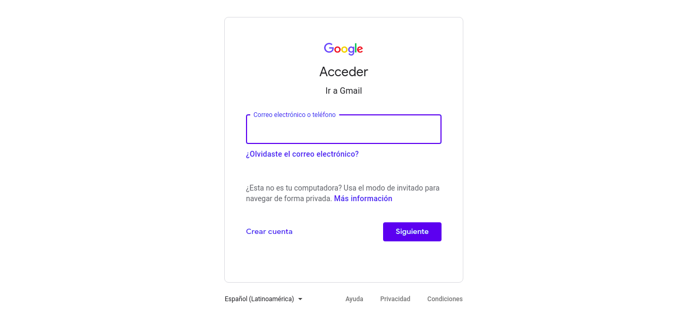

# EmailScrapper

# 

## Description :book:

Email Scrapper service scraps recruiters' accounts from job boards like "Un mejor empleo" every 10 minutes and get the email addresses of the applicants to the offers published by those accounts. Once the applicants' emails have been obtained, the app will send a custom message, by email, with the following steps to the job application.

This service allows job vacancies published on Torre.co to reach a greater number of people.
  
## Visuals :video_camera:

Go to the video bellow to check the working of the project.

  [EmailScrapperWorking](https://www.youtube.com/watch?v=FoQe3cGh-aQ)

## Installation :floppy_disk:

In Ubuntu 16:

- Go inside the folder job_email_scrapper:

```console
foo@bar:~$ cd job_email_scrapper
```

- Give permissions and run the script installDockerCompose

```console
foo@bar:~/job_email_scrapper$ chmod u+x installDockerCompose && ./installDockerCompose
```

Note: If you do not have Ubuntu 16, install Docker and Docker-Compose in yor machine


## Usage :open_file_folder:

0. Go inside the folder job_email_scrapper:


```console
foo@bar:~$ cd job_email_scrapper
```

1. Set the "Un mejor empleo" company credentials in backend/src/config/scrapper.config.js

```console
foo@bar:~/job_email_scrapper$ cd backend/src/config/
foo@bar:~/job_email_scrapper/backend/src/config$ vi scrapper.config.js
/* Credentials of Un Mejor Empleo Job Board */

module.exports = {
  username: '**your username here**',
  password: '**your password here**',
};
```


2. Set the "Gmail" credentials in backend/src/config/sendemail.config.js

```console
foo@bar:~/job_email_scrapper$ cd backend/src/config/
foo@bar:~/job_email_scrapper/backend/src/config$ vi sendemail.config.js
/* Credentials of Job Account */

module.exports = {
  user: '**your username here**', // gmail account
  pass: '**your password here**', // gmail password
};
```



3. Set the "Mysql" credentials in backend/src/config/db.config.js

```console
foo@bar:~/job_email_scrapper$ cd backend/src/config/
foo@bar:~/job_email_scrapper/backend/src/config$ vi db.config.js
/* Credentials of mySQL Database on AWS */

module.exports = {
  HOST: '**your host and port of the db here**',
  USER: '**your username here**',
  PASSWORD: '**your password here**',
  DB: '**your db to handle here**',
  dialect: 'mysql',
  pool: {
    max: 5,
    min: 0,
    acquire: 30000,
    idle: 10000,
  },
};
```

4. Give permissions and run the emailScrapperUp file:

```console
foo@bar:~/job_email_scrapper$ chmod u+x emailScrapperUp && ./emailScrapperUp
```

5. The Stats service runs on 127.0.0.1:3000 or 0.0.0.0:80


6. The API service runs on 127.0.0.1:4000/api/ or 127.0.0.1:4000/api/.

- Note: the endpoints availables are /api/countdata and /api/useroffer/{number}. Example: 127.0.0.1:4000/api/useroffer/2

7. The LandPage runs on 127.0.0.1:80/landing or 0.0.0.0:80/landing


8. If you want to change the custom message to send your users, go to backend/src/util/mail.js function "makeMessage"

```console
foo@bar:~/job_email_scrapper$ cd backend/src/util
foo@bar:~/job_email_scrapper/backend/src/util$ vi mail.js
[...]
   * @returns {any}
   */
  async makeMessage(jobInfo = {}, lang) {
    if (jobInfo) {
[...]
```


## Support :email:

LinkedIn:

- [Arturo Victoria Rincon](https://www.linkedin.com/in/arturovictoriar/)
- [Sebastian Lopez Herrera](https://www.linkedin.com/in/sebaslherrera/)

Twitter:

- [Arturo Victoria Rincon](https://twitter.com/arturovictoriar)
- [Sebastian Lopez Herrera](https://twitter.com/sebasLHerrera)

Portfolio website:

- [Arturo Victoria Rincon](http://arturovictoriar.github.io/)
- [Sebastian Lopez Herrera](https://sebaslherrera.github.io/)

## Authors and acknowledgment :school:

Arturo Victoria Rincon is Mechatronics Engineer with innate leadership and adaptability skills. Focused on developing software to improve people's quality of life using tools such as Python, Javascript, C, and C ++.

Sebastian Lopez Herrera is Software engineer with +2 years of experience as a web developer with assertive communication and problem-solving skills, thriving to tackle challenges in an efficient and creative manner. Self-taught learner, always seeking new boundary-pushing challenges.

Last but not least, thanks to Luis Mesa from Torre.co for accompanying us in the process of development of this project and thanks to Holberton School that taught the way to learn by ourselves.

## License :warning:

:copyright: 2020 All rights reserved.

## Related projects :grey_question:

[Voici d'emploi](https://github.com/GHJ-INC)

## Project status :white_check_mark:

This project just automate the process to contact a job applicants from "Un mejor empleo" job board and it is complete finished.

## Author :black_nib:

* __Arturo Victoria Rincon__ <[arturovictoriar](https://github.com/arturovictoriar)>
* __Sebastian Lopez Herrera__ <[sebaslherrera](https://github.com/sebaslherrera)>
